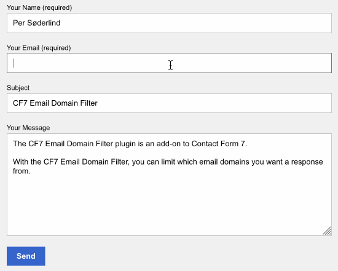

# CF7 Email Domain Filter

The CF7 Email Domain Filter plugin is an add-on to Contact Form 7

With the CF7 Email Domain Filter you can limit the which email domains you want a response from.

|  |
|:--:|
| *btw, per at mail.com isn't my email address* |

## Installation

a) As a plugin

1. Fork the repo
1. Edit cf7-email-domain-filter.php and change the `$email_filter_domains` array.
1. Uppload the changed repo to wp-content/plugins

b) In your (child) theme

1. Copy everything below `namespace Soderlind\CF7\Email\Filter;` and save it in your (child) theme functions.php
1. Change the `$email_filter_domains` array.

## Usage

Add class `domainfilter` to the email tag, eg: `[email your-email class:domainfilter]`

## Credits

[Awesomplete](https://leaverou.github.io/awesomplete/) is Copyright (c) 2015 Lea Verou

## Copyright and License

CF7 Email Domain Filter is copyright 2018 Per Soderlind

CF7 Email Domain Filter is free software: you can redistribute it and/or modify it under the terms of the GNU General Public License as published by the Free Software Foundation, either version 2 of the License, or (at your option) any later version.

CF7 Email Domain Filter is distributed in the hope that it will be useful, but WITHOUT ANY WARRANTY; without even the implied warranty of MERCHANTABILITY or FITNESS FOR A PARTICULAR PURPOSE. See the GNU General Public License for more details.

You should have received a copy of the GNU Lesser General Public License along with the Extension. If not, see http://www.gnu.org/licenses/.

